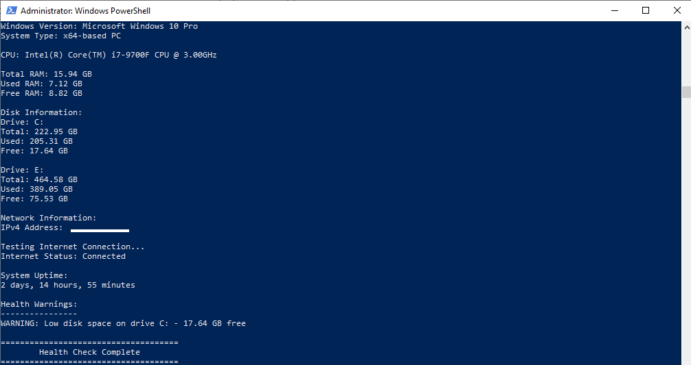

# Windows System Health Checker

A PowerShell-based system health checker designed for basic Windows troubleshooting and IT support.

## Screenshot



## Features

- Displays computer name and logged-in user
- Detects Windows version and system type
- Shows CPU information
- Checks total, used and free RAM
- Checks disk usage and free space
- Displays IPv4 address
- Tests internet connectivity
- Shows system uptime
- Warns about low disk space
- Warns about high memory usage
- Warns about internet connection problems
- Warns when the system has not been restarted for a long period
- Exports results to a text report

## Technologies Used

- PowerShell
- Windows Management Instrumentation / CIM
- Windows networking commands
- Git
- GitHub

## Report Export

The script automatically creates:

`system-health-report.txt`

The report is saved to the user's Desktop.

This provides a simple record of the diagnostic results for troubleshooting and documentation.

## Example Warning

```text
WARNING: Low disk space on drive C: - 17.64 GB free
